

  
  <h1>Codex Local</h1>
  
Your Codex — on your PC, in a browser and on your phone.

  
<strong>Windows x64 · local panel · web access and PWA</strong>

  
<a href="https://github.com/DenisG1302/codex-local/releases/latest"><strong>Download installer</strong></a> · <a href="https://github.com/DenisG1302/codex-local/releases">Release notes</a> · <a href="README.ru.md">Русский</a>

---

Codex Local is an independent Windows app that connects to your installed Codex through App Server. Organize chats by project, run several tasks at once and access your workspace in the desktop app, a local browser or another device.

This repository contains **installers and documentation**. Application source code is maintained separately and is not published here. This app is not an official OpenAI product.

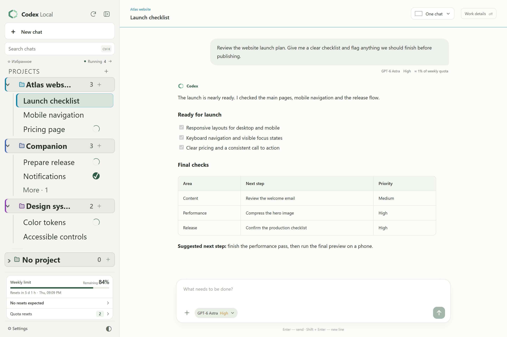

Codex Local 0.8.49 · Actual interface with demo projects and conversations.

## Features

The interface is available in English and Russian. Choose your language in Settings → Appearance.

| Feature | What it adds |
| --- | --- |
| Limits at a glance | Remaining allowance, renewal times and estimated request usage in one place |
| Resets and forecasts | Available resets with confirmation, plus announcements of possible resets from Codex Resets |
| Multiple chats at once | Up to five side-by-side panes, or Focus: one large chat with cards for active and unread tasks |
| Overlay | Follow progress above other apps and switch between chats |
| Replies to messages | Reply to a message or selected passage without copying the text |
| Forwarding between chats | Prepare a message with files and photos in another chat, add a comment and send when ready |
| Quick commands | Send a saved reply with one click; add your own choices and remove ones you do not need |
| Rules with Codex | Edit global instructions or a project’s AGENTS.md; review the assistant’s proposed changes before applying them |
| Model and fast mode | Choose a model and reasoning level; control the speed of the current task separately from the next message |
| Message queue | Edit text, attachments and model settings for each waiting message, and rearrange their order |
| Your own web access | Use the panel in a local browser, over your network or through your own HTTPS domain |
| Phone and PWA | Access chats from your phone and add the panel to your home screen |
| Notification preferences | Choose events, Windows and Web Push delivery, notification sounds, and message previews |
| Themes that fit you | Ten light and ten dark palettes, high contrast, and custom background and accent colors with live previews |

## Overlay

The overlay shows task progress above other apps and tells you when an answer or approval is needed. Open it from the chat’s status row or enable automatic opening when Codex Local is hidden or covered. Switch between running and unread chats, pin the window’s position or open the selected chat. Viewing the overlay does not mark answers as read.

In Settings → Overlay, choose the appearance, size, position and opacity; Test overlay previews your choices before saving. Long text can scroll or expand the window. On Windows, mouse input passes through the window; select it with Alt+Tab to use its controls.

| Progress window | Compact settings |
| --- | --- |
| [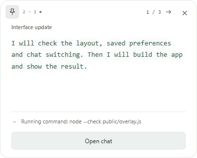](assets/screenshots/en/overlay.png) | [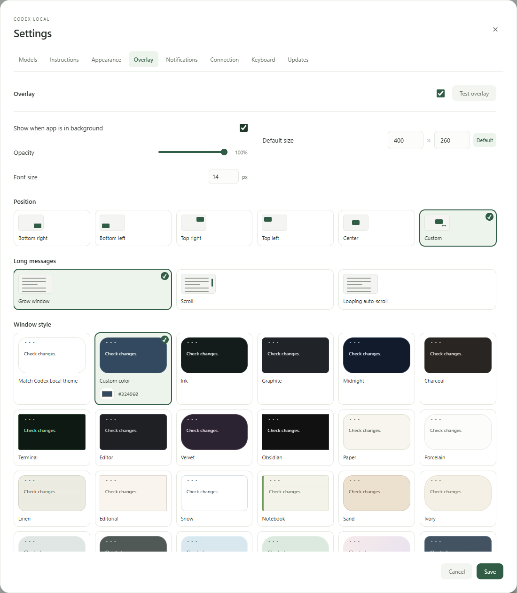](assets/screenshots/en/overlay-settings.png) |

## Rules with the Codex assistant

In Settings → Instructions, edit global rules or a project’s AGENTS.md. The Codex assistant changes and organizes rules at your request. Review the proposed changes and select Apply. New rules take effect in new chats.

## Model, fast mode and message queue

The control beside the composer sets the model, reasoning level and fast mode for the next message. Change the current task’s speed beside its status. Fast mode is available for supported models and uses more of your allowance.

Messages sent during a task wait in a queue. Change their order, text, attachments and settings; Steer sends a message into the current task. The queue survives a restart and works without an open window.

## Replies, forwarding and quick commands

Choose Write a reply from a message’s ⋯ menu, or select a passage and press Reply. The quote appears above the composer so you can answer with context.

Forward prepares a message with its attachments in another chat. Choose the chat, add a comment if needed and press Send.

Quick commands send saved replies with one click. Add your own phrases through Manage quick replies. Replies go first in a busy chat’s queue.

## Review rule changes before applying them

Choose the rules to edit, describe the change and compare the assistant’s proposal with the current text. Apply it when you are ready.

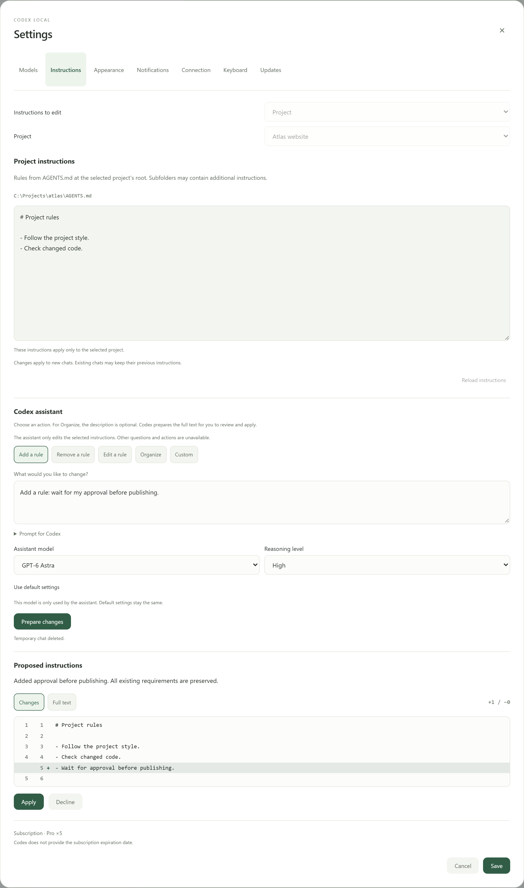

## Plan the next messages

Each queued message has its own model, reasoning level and speed. Edit a waiting message while the current task continues.

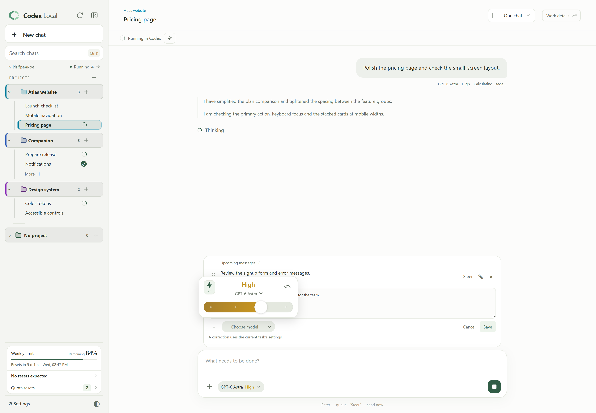

## Keep several tasks in view

Focus mode gives the current conversation more room while keeping running tasks and unread results alongside it.

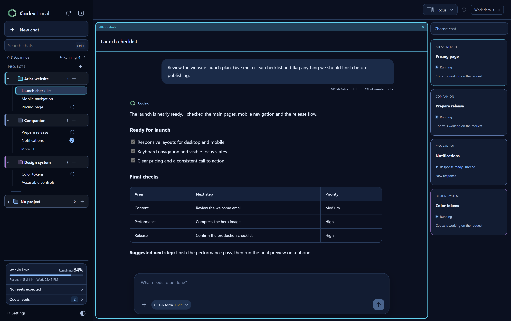

## Open files beside the conversation

Read code with syntax highlighting and line numbers, search within a file, and stay in the same chat.

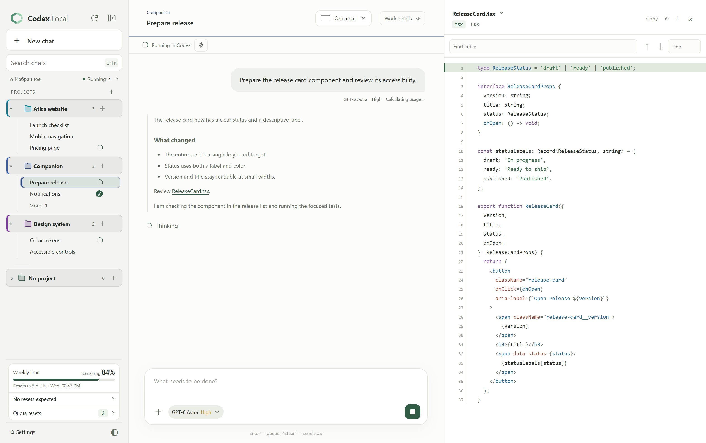

## Make the workspace yours

Pick separate light and dark palettes, then choose the events, delivery channels and message previews you want.

| Appearance and language | Notification preferences |
| --- | --- |
| [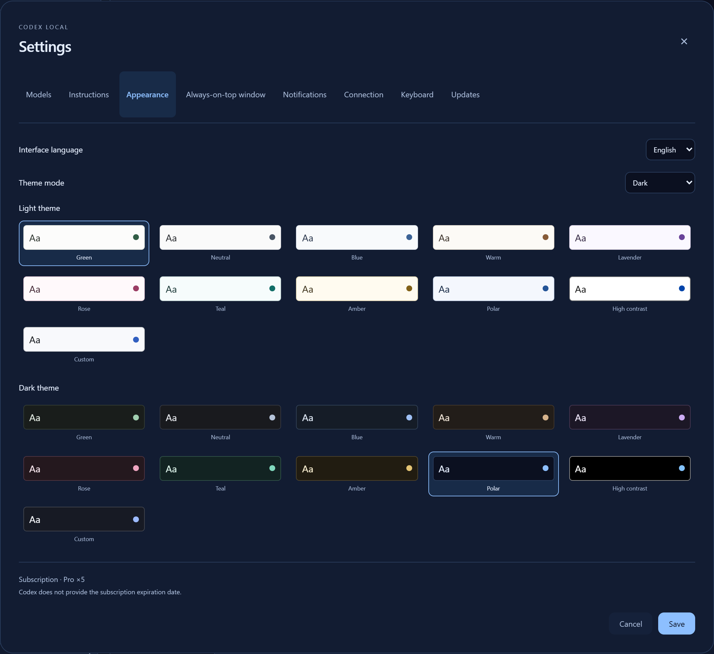](assets/screenshots/en/appearance.png) | [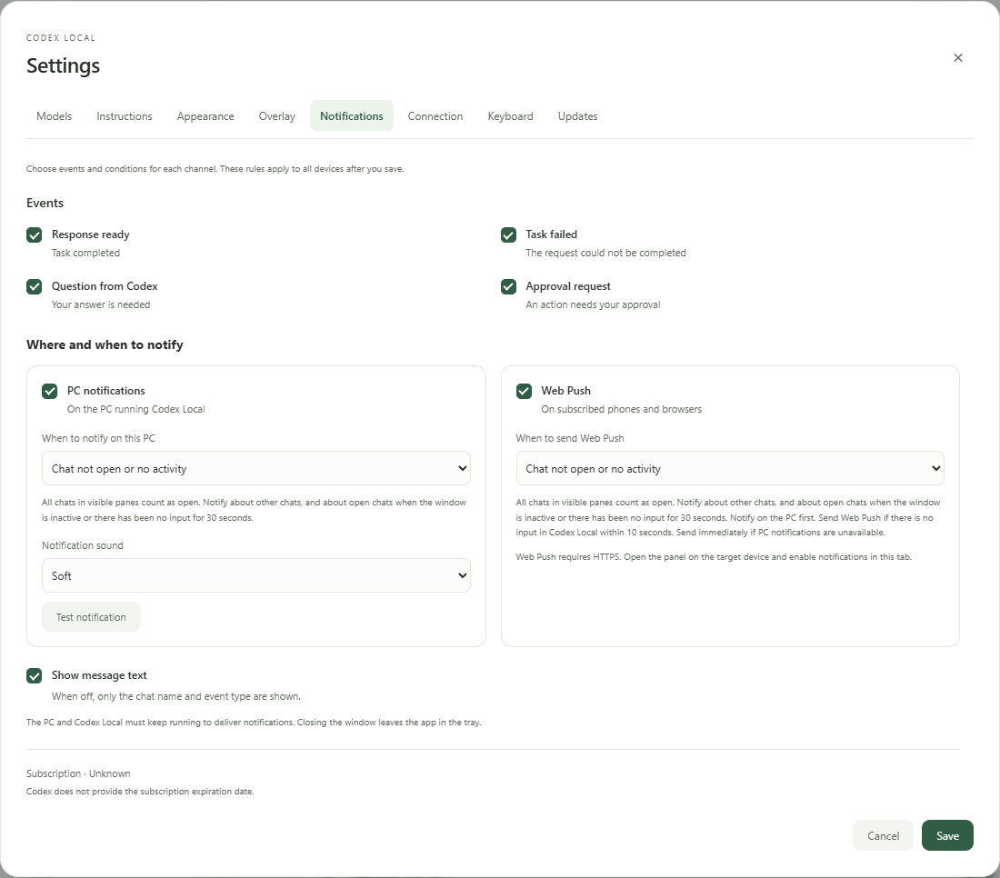](assets/screenshots/en/notifications.png) |

## Take your chats with you

The mobile layout keeps conversations, projects and usage limits within reach. Your Windows PC continues to run the tasks.

  <a href="assets/screenshots/en/mobile-chat.png">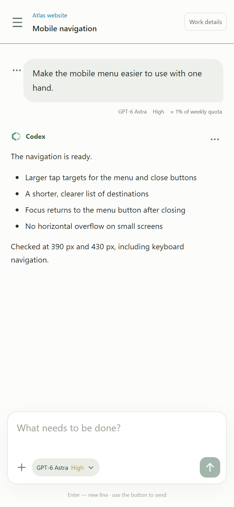</a>
  <a href="assets/screenshots/en/mobile-projects.png">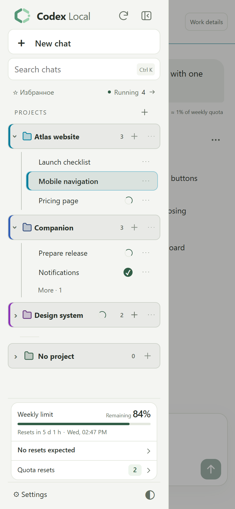</a>

To reply to a passage, select the text and press Reply.

<a href="assets/screenshots/en/mobile-reply.png">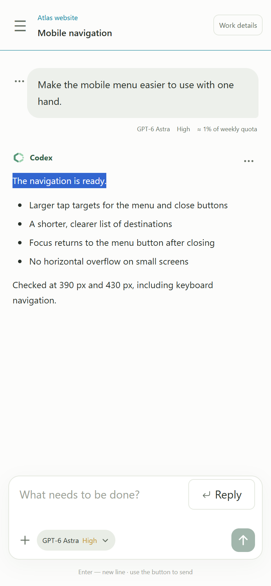</a>

## Ways to connect

| Option | How to open it |
| --- | --- |
| On this PC | Use the Codex Local app or open `http://127.0.0.1:4317` in a browser; the port is configurable |
| On your network | Open **Settings → Connection → Local network**, copy the PC address and open it on another device |
| Over the internet | Configure an HTTPS domain and reverse proxy to the panel, then enter the address in **Settings → Connection → Domain** |
| As a phone app | Open the HTTPS address in a browser, add the panel to your home screen and enable notifications in settings |

All devices connect to the same panel on your Windows PC: project files and task execution remain there. Keep the computer awake and Codex Local running, including in the tray. Set up the domain, certificate and external routing separately; the panel does not provision them automatically. Regular web access over a local IP works without a domain; PWA installation and push on other devices require HTTPS and browser support.

Usage estimates rely on the counters Codex provides and can include other tasks running in parallel. Codex Resets predictions come from a third-party announcement service and do not guarantee a reset. Requests that specifically require confirmation in Codex open in its desktop app.

## Data and access

The installer contains no other user's accounts, conversations, project files or connection settings. Panel data is created on your PC under `%LOCALAPPDATA%\CodexLocal`; Codex manages its own authentication. The panel contacts GitHub for updates and Codex Resets for public reset announcements. Model requests are processed by the services your Codex connects to.

Web access is protected by the panel's local account. To connect a phone, open **Settings → Connection**. PWA push notifications require configured HTTPS access. Keep your panel password and authentication files private.

## Feedback

[Open an issue](https://github.com/DenisG1302/codex-local/issues/new) with the app version, expected behavior and reproduction steps. Remove personal information from screenshots. Do not attach tokens, session directories or complete logs containing private conversations.

Third-party component license notices are included with the installation. Public availability of the installer does not make the application source code public.
