

  
  <h1>Codex Local</h1>
  
Ваш Codex — на ПК, в браузере и на телефоне.

  
<strong>Windows x64 · локальная панель · веб-доступ и PWA</strong>

  
<a href="https://github.com/DenisG1302/codex-local/releases/latest"><strong>Скачать установщик</strong></a> · <a href="https://github.com/DenisG1302/codex-local/releases">Что нового</a> · <a href="README.md">English</a>

---

Codex Local — независимое Windows-приложение для работы с установленным Codex через App Server. Собирайте чаты по проектам, ведите несколько задач одновременно и открывайте своё рабочее пространство в приложении, локальном браузере или с другого устройства.

Этот репозиторий содержит **готовые установщики и документацию**. Исходный код приложения хранится отдельно и не публикуется здесь. Приложение не является официальным продуктом OpenAI.

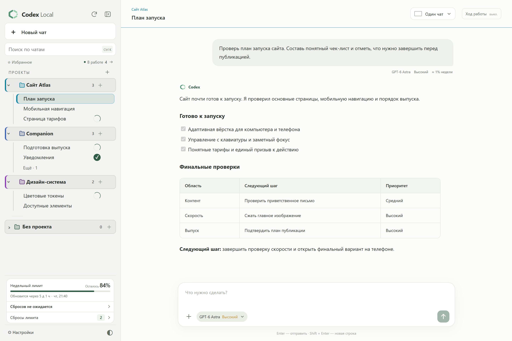

Codex Local 0.8.35 · Настоящий интерфейс с демонстрационными проектами и перепиской.

## Что умеет

Интерфейс доступен на английском и русском. Язык можно выбрать в **Настройки → Оформление**.

| Возможность | Что даёт |
| --- | --- |
| Лимиты перед глазами | Остаток лимита, время обновления и примерный расход запроса в одном месте |
| Сбросы и прогнозы | Доступные сбросы с подтверждением и анонсы возможных сбросов Codex Resets |
| Несколько чатов сразу | До пяти окон рядом или «Фокус»: один большой чат и карточки работающих и непрочитанных задач |
| Окно поверх всех | Полный последний текст о ходе работы и короткие статусы поверх приложений, закрепление и переключение работающих и непрочитанных чатов |
| Ответы на сообщения | Ответ на сообщение или выделенный фрагмент с контекстом над полем ввода; в занятом чате ответы идут первыми в очереди |
| Пересылка между чатами | Подготовка сообщения с файлами и фотографиями в другом чате, комментарий и отправка по кнопке |
| Быстрые команды | Готовые ответы одним нажатием: добавляйте свои варианты и удаляйте ненужные |
| Правила с помощником Codex | Глобальные инструкции или AGENTS.md проекта; просмотр предложенных изменений перед применением |
| Модель и ускорение | Выбор модели и рассуждения; отдельное управление скоростью текущей задачи и следующего сообщения |
| Очередь сообщений | Редактирование текста, вложений и настроек каждого ожидающего сообщения, изменение порядка |
| Собственный веб-доступ | Панель в локальном браузере, по сети или через свой HTTPS-домен |
| Телефон и PWA | Доступ к чатам с телефона и установка панели на главный экран |
| Настраиваемые уведомления | Выбор событий, доставки через Windows и Web Push, звука уведомлений и показа текста сообщения |
| Темы на свой вкус | По 10 светлых и тёмных палитр, высокий контраст и свои цвета фона и акцента с живым предпросмотром |

## Окно поверх всех

Откройте окно кнопкой в шапке чата. В Windows оно остаётся поверх других приложений и может появляться автоматически, когда Codex Local свёрнут или в фоне. Закрепите его, чтобы случайно не сдвинуть мышью. Стрелка переключает работающие и непрочитанные чаты; просмотр не отмечает ответы прочитанными.

В окне показываются полный последний текст о ходе работы и короткий статус со спиннером: «Думаю», «Работаю над задачей», «Оптимизация беседы». Команды и их вывод скрыты. Когда задача закончена, появляется **«Работа закончена»**; иконка **«Открыть чат»** рядом с крестиком доступна всегда.

В **Настройки → Окно поверх всех** выберите стиль текста и оформление по карточкам с примерами. **Тестовый оверлей** открывает настоящее окно с выбранными размерами и оформлением до сохранения; **По умолчанию** возвращает ширину и высоту 400 × 260. Длинный текст можно прокручивать вручную, читать сверху вниз по кругу или увеличивать окно в пределах экрана. При наведении автопрокрутка останавливается для ручного чтения и продолжается после ухода курсора. Палитра своего цвета появляется прямо в карточке «Свой цвет». Там же задаются цвет темы, положение, непрозрачность и автопоявление. Полное отключение скрывает кнопку в чате и дополнительные настройки. В поддерживающих браузерах доступно ручное открытие через Picture-in-Picture.

| Окно с ходом работы | Компактные настройки |
| --- | --- |
| [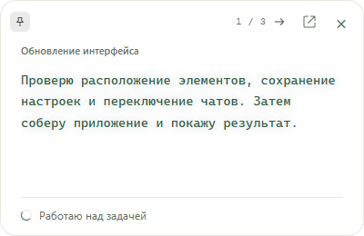](assets/screenshots/ru/overlay.png) | [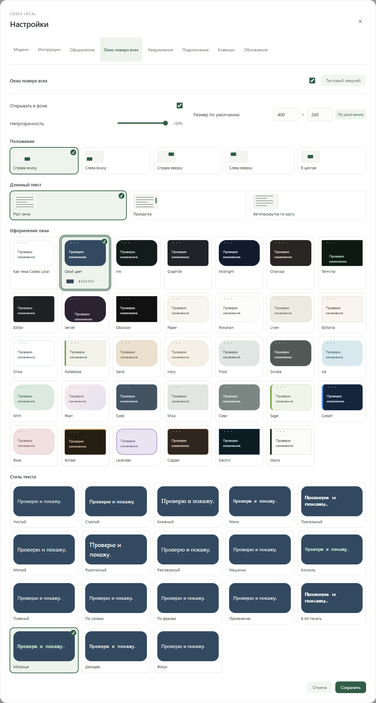](assets/screenshots/ru/overlay-settings.png) |

## Правила с помощником Codex

В **Настройки → Инструкции** можно редактировать глобальные правила или **AGENTS.md** выбранного проекта. Если файла правил ещё нет, создайте его в том же разделе.

Помощник умеет добавлять, убирать и изменять правила, упорядочивать текст или выполнять запрос **«Своё»**. Для **«Упорядочить»** описание необязательно. Модель и рассуждение помощника выбираются отдельно от настроек чата. Проверьте предложенный полный текст или изменения строк: предложение можно поправить, принять кнопкой **«Применить»** или отклонить. Изменения применяются к новым чатам; уже открытые могут сохранять прежние инструкции.

## Модель, ускорение и очередь сообщений

Кнопка рядом с полем ввода объединяет выбор модели, уровня рассуждения и ускорения. Скорость текущей задачи меняется отдельно — кнопкой рядом со статусом выполнения, после подтверждения. Ускоренный режим доступен для поддерживаемых моделей и расходует лимит быстрее.

Сообщения, отправленные во время работы, ждут в очереди. Меняйте их порядок, редактируйте текст и вложения, задавайте каждому свою модель, рассуждение и скорость. **«Скорректировать»** передаёт ожидающее сообщение в текущую задачу с её настройками. Очередь сохраняется после перезапуска и работает без открытого окна.

## Ответы, пересылка и быстрые команды

Откройте меню **«⋯»** у сообщения и выберите **«Ответить своим текстом»**. Исходное сообщение появится над полем ввода: напишите ответ без копирования длинного оригинала. Для ответа на конкретный фрагмент выделите его и нажмите **«Ответить»**. Уже набранный черновик сохраняется.

На телефоне **«Ответить»** появляется справа на уровне первой строки поля ввода, отдельно от системного меню выделения. После нажатия чат прокручивается вниз, а поле ответа и отправка остаются над клавиатурой. Нажатие вне поля закрывает клавиатуру и сохраняет черновик. Крестик отмены ответа закрывает клавиатуру только при пустом поле; если текст уже набран, ввод остаётся активным.

**«Переслать»** подготавливает выбранное сообщение с файлами и фотографиями в другом чате. Выберите проект, затем новый чат или один из последних пяти; следующие пять доступны по кнопке. Над полем ввода выбранного чата появится карточка: можно дописать комментарий, сохранить черновик или отменить пересылку. Сообщение отправляется только по кнопке отправки. После отправки можно также уведомить исходный чат, что сообщение предназначалось другому чату.

Быстрые команды — готовые ответы в том же меню. Через **«Настроить готовые ответы»** можно добавить свои фразы или удалить любые варианты, включая **«Это не тебе»**. В занятом чате ответы на сообщения и выделенные фрагменты, включая готовые ответы, ставятся в начало очереди и ждут завершения текущей задачи.

## Скриншоты

### Проверяйте изменения правил перед применением

Выберите нужные инструкции, опишите изменение и сравните предложение помощника с текущим текстом. Примените его, когда результат вас устроит.

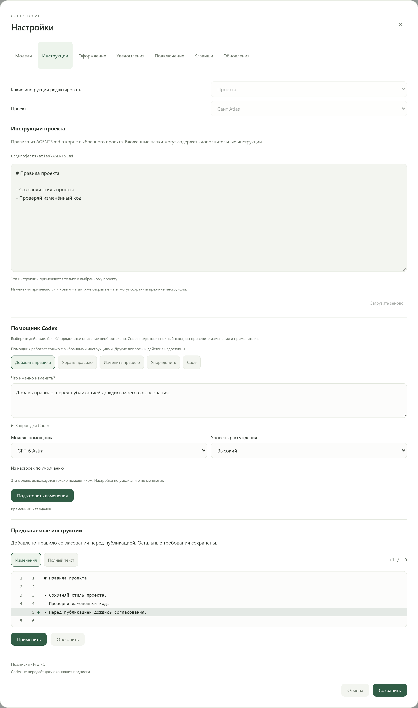

### Планируйте следующие сообщения

У каждого сообщения в очереди свои модель, рассуждение и скорость. Его можно редактировать, пока текущая задача продолжает работу.

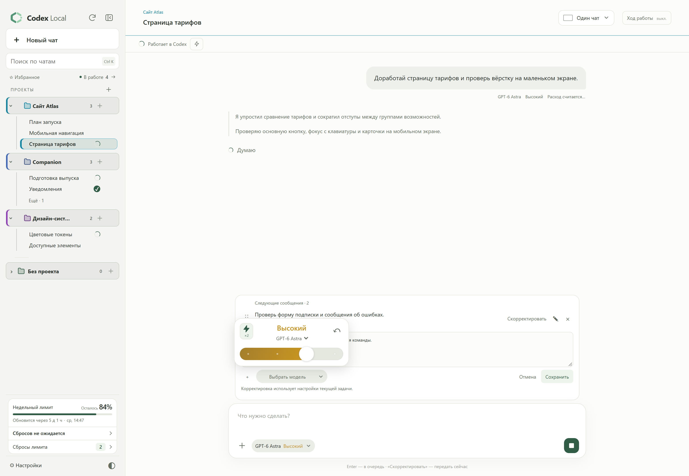

### Несколько задач перед глазами

В режиме «Фокус» текущий разговор занимает большую область, а работающие задачи и непросмотренные результаты остаются рядом.

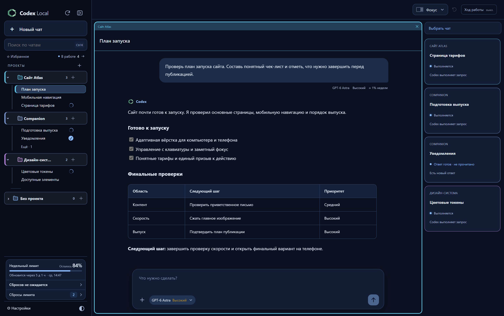

### Файлы рядом с перепиской

Читайте код с подсветкой синтаксиса и номерами строк, ищите по файлу и продолжайте работать в том же чате.

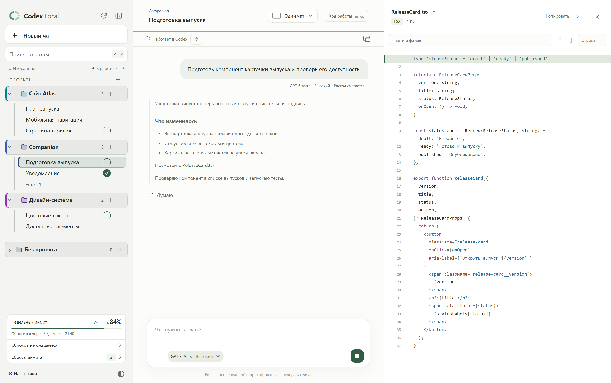

### Оформление и уведомления под себя

Выберите отдельные палитры для светлой и тёмной темы, нужные события и каналы уведомлений, а также показ текста сообщения.

| Оформление и язык | Настройки уведомлений |
| --- | --- |
| [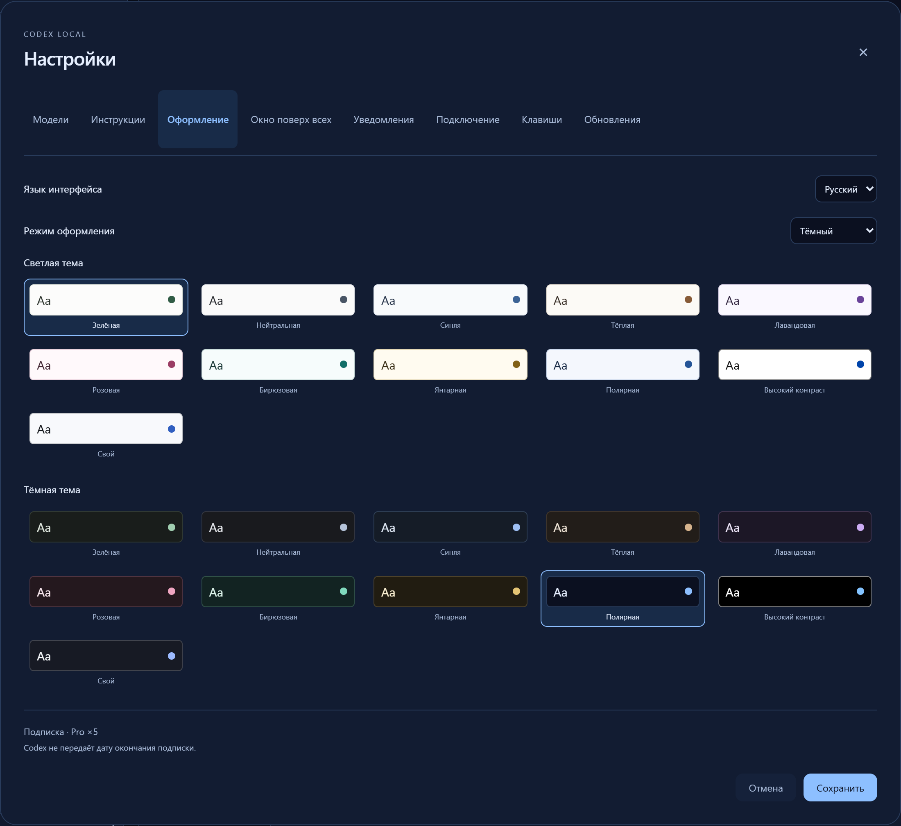](assets/screenshots/ru/appearance.png) | [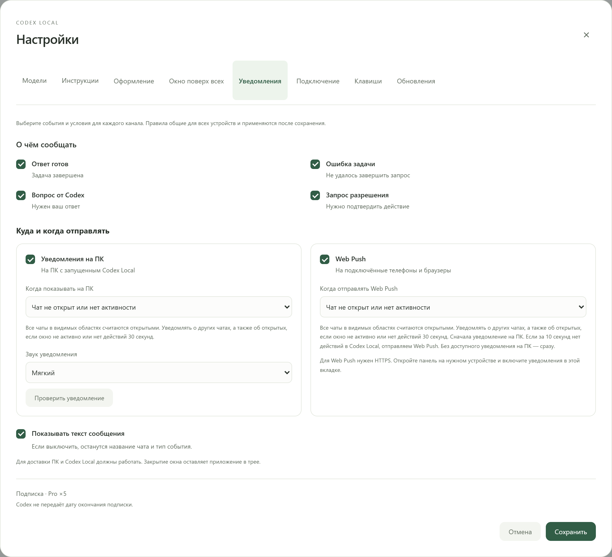](assets/screenshots/ru/notifications.png) |

### Чаты всегда под рукой

На телефоне доступны переписка, проекты и оставшиеся лимиты. Задачи продолжает выполнять ваш Windows-ПК.

  <a href="assets/screenshots/ru/mobile-chat.png">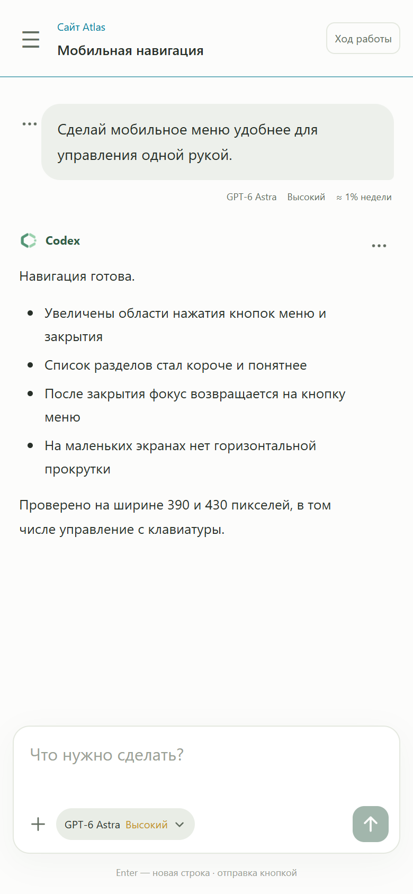</a>
  <a href="assets/screenshots/ru/mobile-projects.png">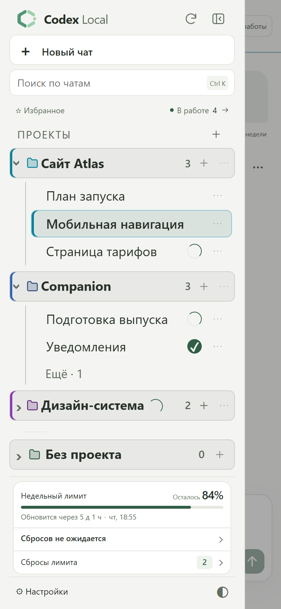</a>

Выделите фрагмент сообщения и нажмите **«Ответить»** в форме ввода. Кнопка расположена справа на уровне текста «Что нужно сделать?», отдельно от системных действий с выделенным текстом.

<a href="assets/screenshots/ru/mobile-reply.png">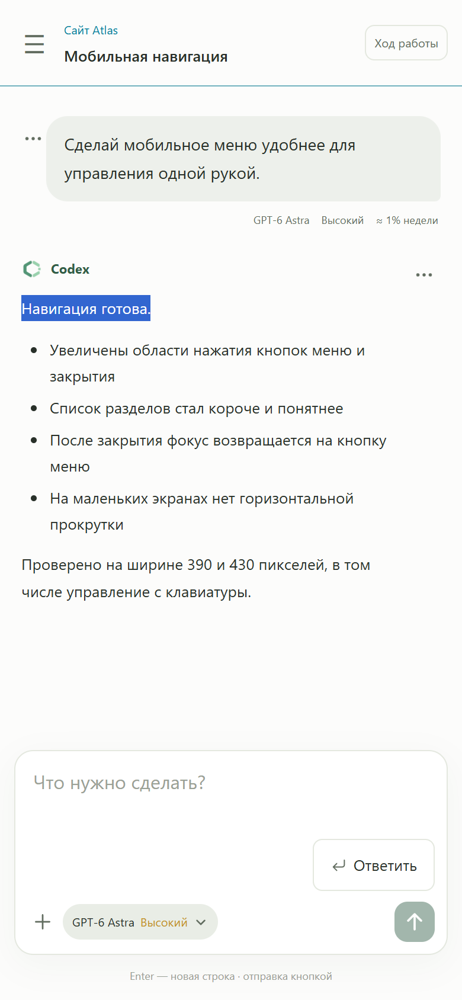</a>

## Где можно пользоваться

| Вариант | Как открыть |
| --- | --- |
| На этом ПК | Приложение Codex Local или `http://127.0.0.1:4317` в браузере; порт можно изменить |
| В своей сети | **Настройки → Подключение → Локальная сеть**: скопируйте адрес ПК и откройте его на другом устройстве |
| Через интернет | Настройте HTTPS-домен и обратный прокси к панели, затем укажите адрес в **Настройки → Подключение → Через домен** |
| Как приложение на телефоне | Откройте HTTPS-адрес в браузере и добавьте панель на главный экран; включите уведомления в настройках |

Это доступ к одной панели на вашем Windows-ПК: файлы и выполнение задач остаются на нём. Компьютер должен быть включён, а Codex Local — запущен, в том числе в трее. Домен, сертификат и внешнюю маршрутизацию нужно настроить отдельно; панель не создаёт их автоматически. Обычный веб-доступ по локальному IP работает без домена, а PWA и push на других устройствах требуют HTTPS и поддержки браузера.

Оценка расхода основана на доступных счётчиках Codex: при параллельной работе она может учитывать несколько задач. Прогнозы Codex Resets — объявления стороннего сервиса, а не гарантия сброса. Запросы, требующие подтверждения именно в Codex, открываются в его приложении на ПК.

## Данные и доступ

Установщик не содержит чужих аккаунтов, переписки, файлов проектов или настроек подключения. Данные панели создаются на вашем ПК в `%LOCALAPPDATA%\CodexLocal`; авторизацией Codex управляет сам Codex. Панель обращается к GitHub за обновлениями и к Codex Resets за публичным расписанием сбросов. Запросы к моделям обрабатываются сервисами, к которым подключён ваш Codex.

Веб-доступ защищён локальным аккаунтом панели. Для телефона откройте **Настройки → Подключение**; для PWA с push-уведомлениями нужен настроенный HTTPS-доступ. Не публикуйте пароль панели или файлы авторизации.

## Обратная связь

Нашли ошибку? [Создайте issue](https://github.com/DenisG1302/codex-local/issues/new): укажите версию, ожидаемое поведение и шаги воспроизведения. Уберите со скриншотов личные данные. Не прикладывайте токены, папки сессий или полные журналы с приватной перепиской.

Сведения о компонентах и их лицензиях включены в установку. Публичная доступность установщика не означает публикацию исходников приложения.
