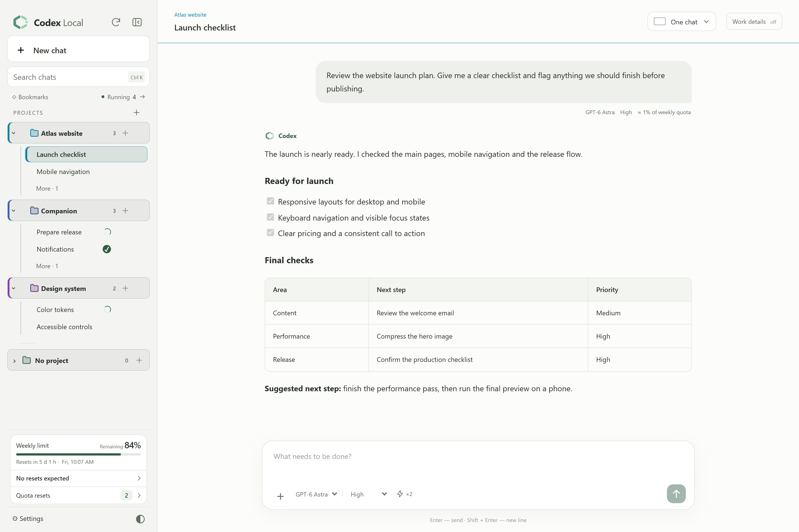
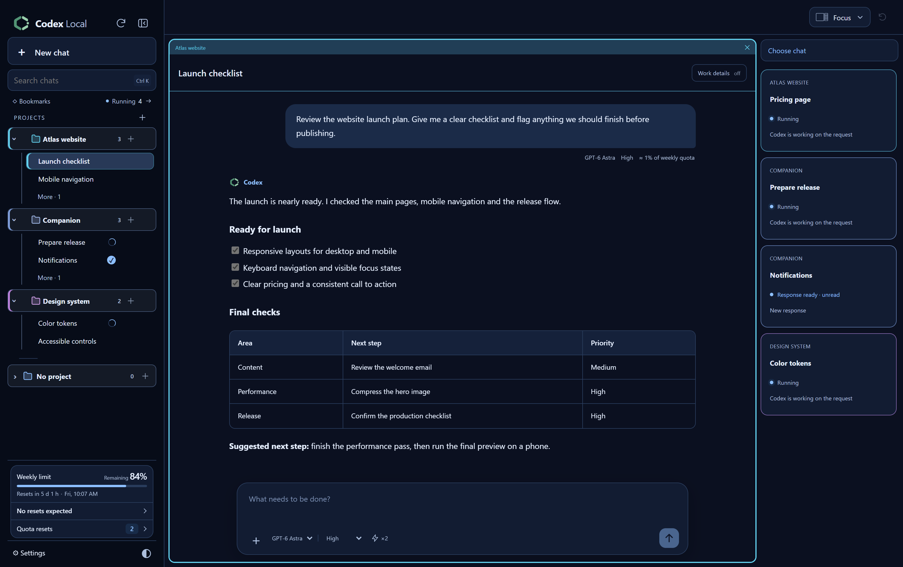
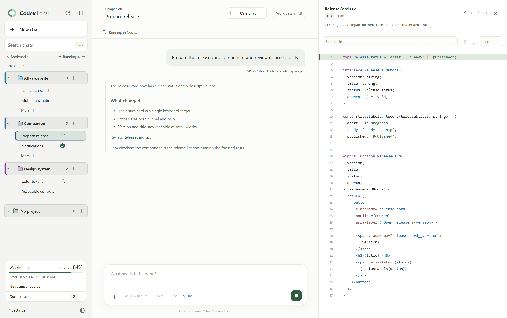
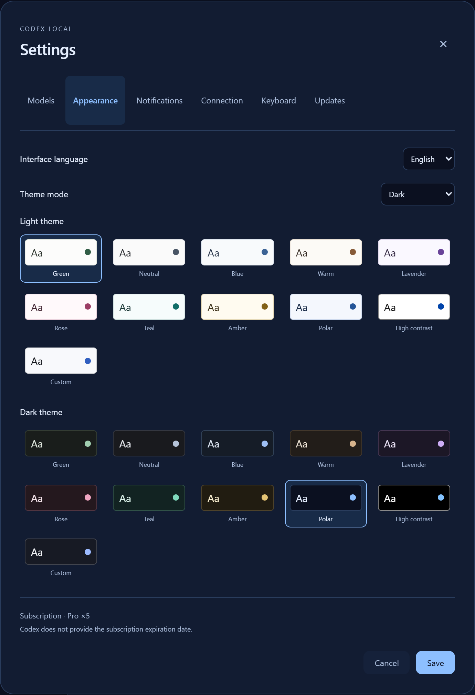
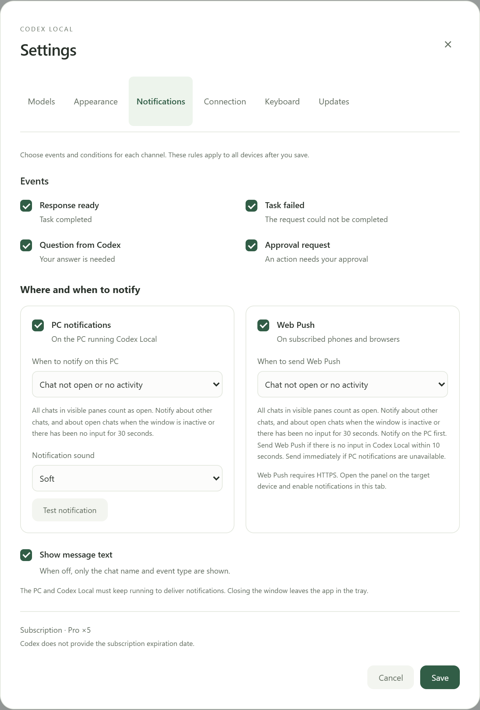
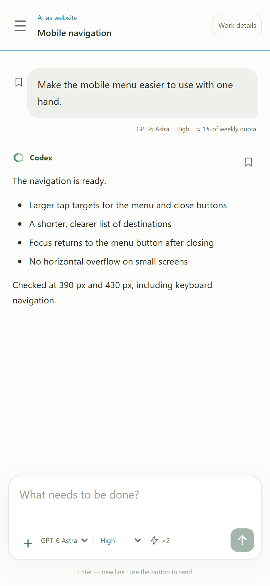
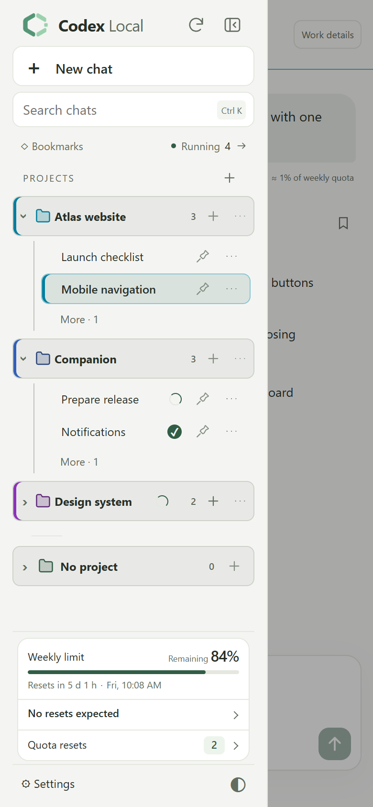

  
  <h1>Codex Local</h1>
  
Ваш Codex — на ПК, в браузере и на телефоне.

  
<strong>Windows x64 · локальная панель · веб-доступ и PWA</strong>

  
<a href="https://github.com/DenisG1302/codex-local/releases/latest"><strong>Скачать установщик</strong></a> · <a href="https://github.com/DenisG1302/codex-local/releases">Что нового</a> · <a href="README.md">English</a>

---

Codex Local — независимое Windows-приложение для работы с установленным Codex через App Server. Собирайте чаты по проектам, ведите несколько задач одновременно и открывайте своё рабочее пространство в приложении, локальном браузере или с другого устройства.

Этот репозиторий содержит **готовые установщики и документацию**. Исходный код приложения хранится отдельно и не публикуется здесь. Приложение не является официальным продуктом OpenAI.

Codex Local 0.8.6 · Настоящий интерфейс с демонстрационными проектами и перепиской.

## Что умеет

Интерфейс доступен на английском и русском. Язык можно выбрать в **Настройки → Оформление**.

| Возможность | Что даёт |
| --- | --- |
| Лимиты перед глазами | Остаток лимита, время обновления и примерный расход запроса в одном месте |
| Сбросы и прогнозы | Доступные сбросы с подтверждением и анонсы возможных сбросов Codex Resets |
| Несколько чатов сразу | До пяти окон рядом или «Фокус»: один большой чат и карточки работающих и непрочитанных задач |
| Собственный веб-доступ | Панель в локальном браузере, по сети или через свой HTTPS-домен |
| Телефон и PWA | Доступ к чатам с телефона и установка панели на главный экран |
| Настраиваемые уведомления | Выбор событий, доставки через Windows и Web Push, звука уведомлений и показа текста сообщения |
| Темы на свой вкус | По 10 светлых и тёмных палитр, высокий контраст и свои цвета фона и акцента с живым предпросмотром |

## Скриншоты

### Несколько задач перед глазами

В режиме «Фокус» текущий разговор занимает большую область, а работающие задачи и непросмотренные результаты остаются рядом.

### Файлы рядом с перепиской

Читайте код с подсветкой синтаксиса и номерами строк, ищите по файлу и продолжайте работать в том же чате.

### Оформление и уведомления под себя

Выберите отдельные палитры для светлой и тёмной темы, нужные события и каналы уведомлений, а также показ текста сообщения.

| Оформление и язык | Настройки уведомлений |
| --- | --- |
|  |  |

### Чаты всегда под рукой

На телефоне доступны переписка, проекты и оставшиеся лимиты. Задачи продолжает выполнять ваш Windows-ПК.

  
  

## Где можно пользоваться

| Вариант | Как открыть |
| --- | --- |
| На этом ПК | Приложение Codex Local или `http://127.0.0.1:4317` в браузере; порт можно изменить |
| В своей сети | **Настройки → Подключение → Локальная сеть**: скопируйте адрес ПК и откройте его на другом устройстве |
| Через интернет | Настройте HTTPS-домен и обратный прокси к панели, затем укажите адрес в **Настройки → Подключение → Через домен** |
| Как приложение на телефоне | Откройте HTTPS-адрес в браузере и добавьте панель на главный экран; включите уведомления в настройках |

Это доступ к одной панели на вашем Windows-ПК: файлы и выполнение задач остаются на нём. Компьютер должен быть включён, а Codex Local — запущен, в том числе в трее. Домен, сертификат и внешнюю маршрутизацию нужно настроить отдельно; панель не создаёт их автоматически. Обычный веб-доступ по локальному IP работает без домена, а PWA и push на других устройствах требуют HTTPS и поддержки браузера.

Оценка расхода основана на доступных счётчиках Codex: при параллельной работе она может учитывать несколько задач. Прогнозы Codex Resets — объявления стороннего сервиса, а не гарантия сброса. Запросы, требующие подтверждения именно в Codex, открываются в его приложении на ПК.

## Данные и доступ

Установщик не содержит чужих аккаунтов, переписки, файлов проектов или настроек подключения. Данные панели создаются на вашем ПК в `%LOCALAPPDATA%\CodexLocal`; авторизацией Codex управляет сам Codex. Панель обращается к GitHub за обновлениями и к Codex Resets за публичным расписанием сбросов. Запросы к моделям обрабатываются сервисами, к которым подключён ваш Codex.

Веб-доступ защищён локальным аккаунтом панели. Для телефона откройте **Настройки → Подключение**; для PWA с push-уведомлениями нужен настроенный HTTPS-доступ. Не публикуйте пароль панели или файлы авторизации.

## Обратная связь

Нашли ошибку? [Создайте issue](https://github.com/DenisG1302/codex-local/issues/new): укажите версию, ожидаемое поведение и шаги воспроизведения. Уберите со скриншотов личные данные. Не прикладывайте токены, папки сессий или полные журналы с приватной перепиской.

Сведения о компонентах и их лицензиях включены в установку. Публичная доступность установщика не означает публикацию исходников приложения.
